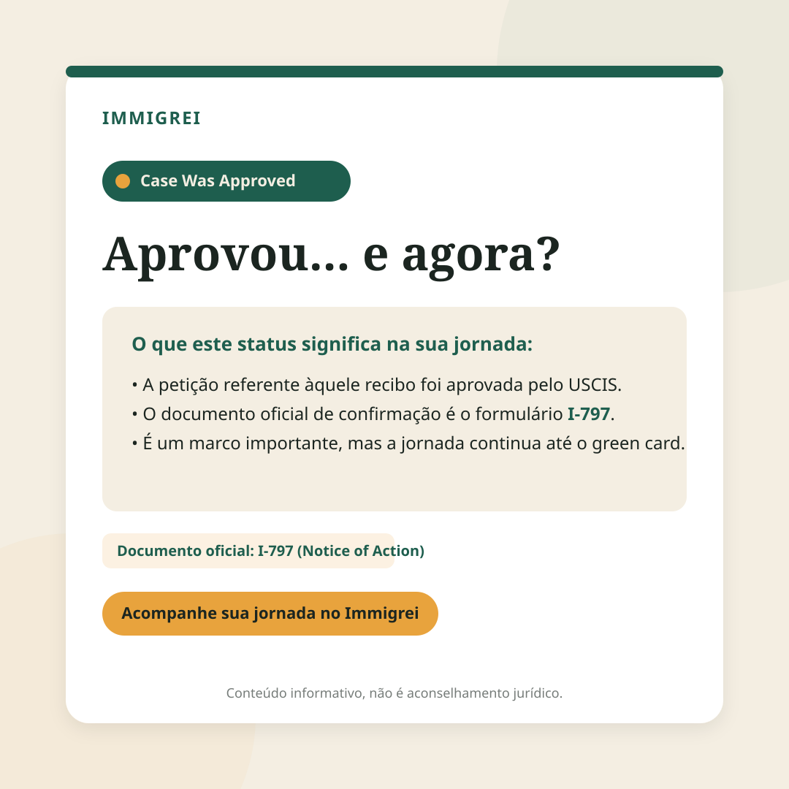
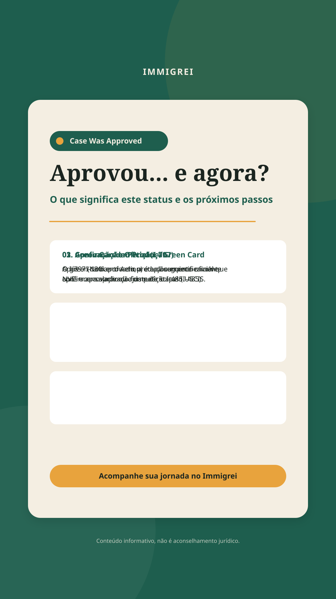
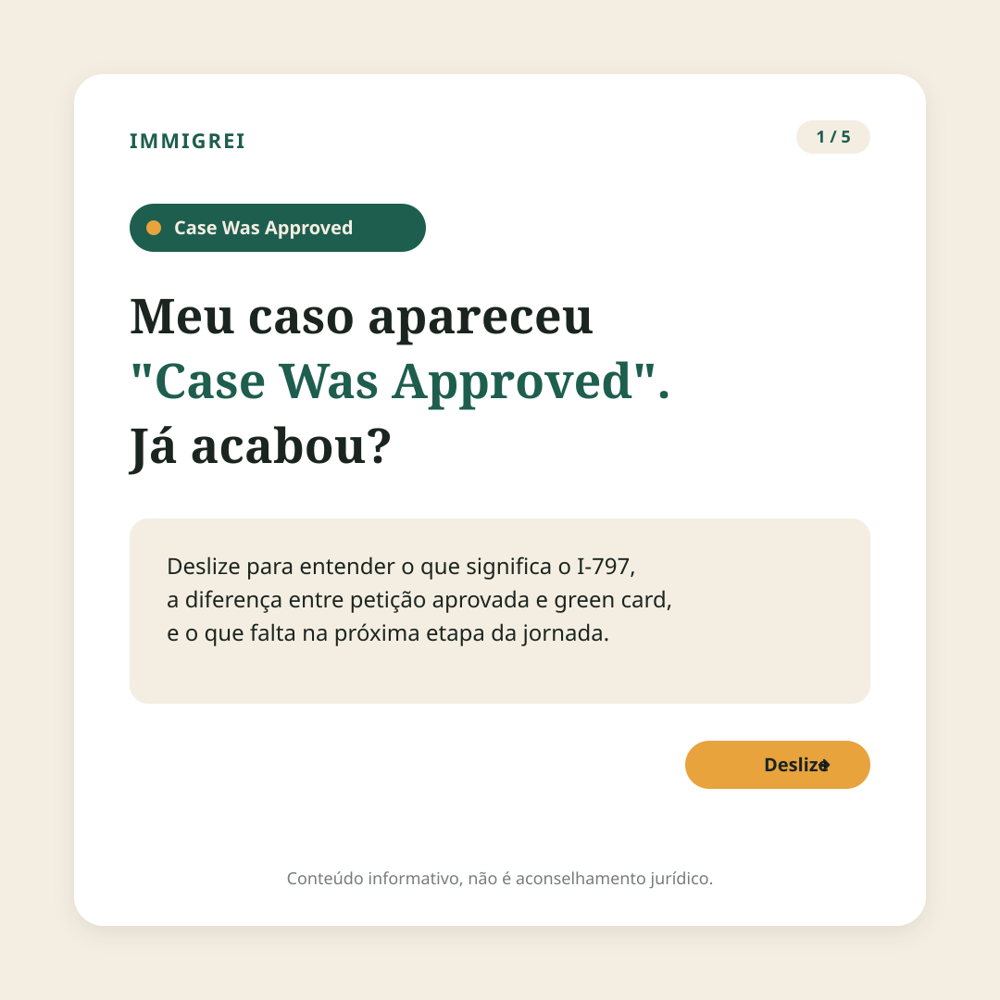
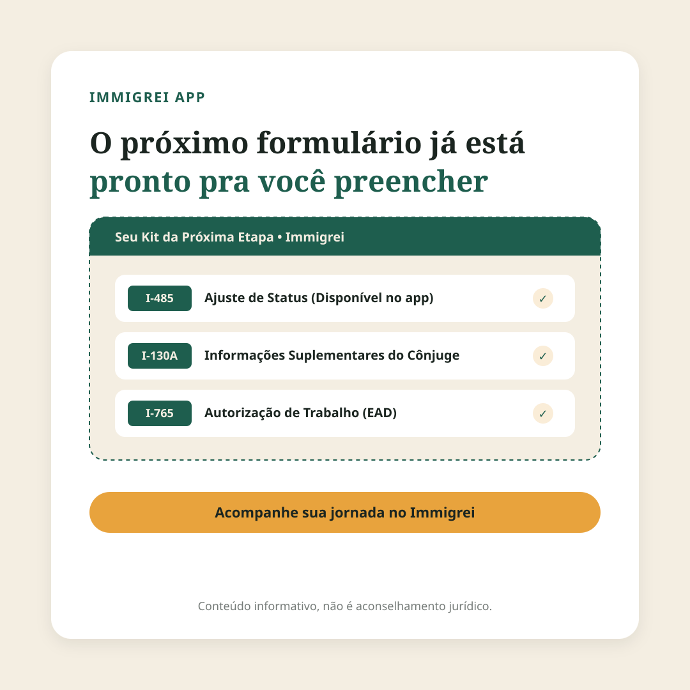

# Rodada de Criativos 1 — Immigrei
**Tema:** Draft "Case Was Approved" — o que significa (e o que ainda falta)  
**Status:** 🟡 **Aguardando Aprovação Manual (Felipe e César)** — *Nenhuma publicação foi agendada ou enviada.*

---

> [!IMPORTANT]
> **Check de Compliance & UPL (Unauthorized Practice of Law)**
> Como este round é manual e não passou pelo gate automatizado de compliance-fact-check:
> 1. **Status em Inglês Verbatim:** Preservado exatamente como `"Case Was Approved"`.
> 2. **Linguagem Não-Direcionada (UPL-safe):** Não há nenhuma frase prescritiva ("você deve", "seu caso vai"). O texto aborda o funcionamento geral das etapas do USCIS.
> 3. **Sem Afiliação Governamental:** Nenhum logo, selo ou elemento do USCIS/governo americano foi incluído.
> 4. **Disclaimer Obrigatório em Todas as Peças:** Rodapé contendo a frase *“Conteúdo informativo, não é aconselhamento jurídico.”*
> 5. **CTA Discreto:** Padronizado para *“Acompanhe sua jornada no Immigrei”* sem apelo agressivo de vendas.
> 6. **Fatos Estritamente Alinhados:** I-797 como confirmação oficial; aprovação da petição ≠ green card; etapas seguintes (NVC+consulado ou I-485); green card em produção após I-485.

---

## Guia de Identidade Visual Aplicada
- **Pine (`#1E5E4E`):** Cor primária de fundos, elementos de estrutura e badges institucionais.
- **Cream (`#F4EEE2`):** Cor primária de telas, cards e leitura limpa.
- **Amber (`#E8A33D`):** Destaque visual, pequenos acentos e CTA discreto.
- **Ink (`#1B2520`):** Cor de texto principal (alto contraste e legibilidade).
- **Tipografia:** *Fraunces (Weight 600)* nos títulos emocionais/hooks; *Hanken Grotesk* no corpo e badges.

---

## Peça 1: Feed Instagram (1:1) — Celebração Comedida

### Visual Preview


### Prompt para Nano Banana / Gerador de Arte
```text
Graphic design for Instagram feed post (1:1 square ratio). Clean cream (#F4EEE2) background with a deep pine green (#1E5E4E) highlight card in center. Features status badge verbatim "Case Was Approved". Elegant headline in Fraunces serif font "Aprovou... e agora?". Warm amber (#E8A33D) subtle accent pill. Text in dark ink (#1B2520). Modern typography layout using Hanken Grotesk for body. Small footer text at bottom: "Conteúdo informativo, não é aconselhamento jurídico." Flat vector graphic style, trustworthy Brazilian brand aesthetic, no government logos, no blue or corporate gray.
```

### Legenda (Copy PT-BR)
Ver aquele status mudo de **"Case Was Approved"** na tela traz um alívio enorme. Dá até vontade de comemorar — e com razão, afinal é uma vitória importante na jornada! 💚

Mas o que esse status realmente significa no sistema do USCIS?

• **Confirmação Oficial:** A aprovação da petição é confirmada pelo documento oficial I-797 (Notice of Action).  
• **Um marco, não o fim:** Ter a petição (como o I-130) aprovada não significa que o green card já foi emitido.  
• **O que vem a seguir:** A jornada segue para a próxima fase — que pode ser o processo consular via NVC ou o Ajuste de Status (I-485). O green card só entra em produção após a aprovação do formulário I-485.

Entender cada etapa traz tranquilidade para planejar os próximos passos com clareza.

---
👉 **Acompanhe sua jornada no Immigrei**

*Conteúdo informativo, não é aconselhamento jurídico.*

---

## Peça 2: Stories / Reels Capa (9:16) — Formato Vertical

### Visual Preview


### Prompt para Nano Banana / Gerador de Arte
```text
Graphic design for Instagram Stories or Reels cover (9:16 vertical ratio). Rich dark pine green (#1E5E4E) background with subtle cream (#F4EEE2) card container. Badge with exact text "Case Was Approved". Large elegant headline in Fraunces serif typography: "Aprovou... e agora?". Three structured info cards inside in white and cream with ink text (#1B2520). Warm amber (#E8A33D) accent line and button at bottom "Acompanhe sua jornada no Immigrei". Small text footer: "Conteúdo informativo, não é aconselhamento jurídico." Premium vector UI mockup style.
```

### Legenda / Texto Complementar (Copy PT-BR)
Apareceu **"Case Was Approved"** e bateu aquela dúvida sobre o que vem depois? 📲

Salve este Story para lembrar dos 3 pontos centrais:
1️⃣ O I-797 (Notice of Action) é o documento oficial da aprovação.  
2️⃣ Petição aprovada é um grande avanço, mas o green card depende da etapa seguinte (NVC + consulado ou I-485).  
3️⃣ O green card é confeccionado quando o formulário I-485 é aprovado.

---
👉 **Acompanhe sua jornada no Immigrei**

*Conteúdo informativo, não é aconselhamento jurídico.*

---

## Peça 3: Carrossel Slide 1 (1:1) — Pergunta Hook Editorial

### Visual Preview


### Prompt para Nano Banana / Gerador de Arte
```text
Graphic design for Instagram Carousel Slide 1 (1:1 square ratio). Warm cream (#F4EEE2) background with a refined white card enclosure. Top right slide counter "1/5" in pine green (#1E5E4E). Status badge displaying exact English phrase "Case Was Approved". Bold editorial headline in Fraunces serif style: "Meu caso apareceu 'Case Was Approved'. Já acabou?". Warm amber (#E8A33D) pill button with arrow pointing right and text "Deslize". Small footer text: "Conteúdo informativo, não é aconselhamento jurídico." High-end typography design, warm and clear tone.
```

### Legenda (Copy PT-BR)
"Meu caso apareceu **'Case Was Approved'**. Já acabou?" 🤔

Essa é uma das dúvidas mais comuns de quem acompanha o status do processo no USCIS. A resposta direta é: a aprovação da petição é um marco essencial, mas a jornada imigratória tem etapas distintas.

Neste carrossel, desmistificamos o que muda com o I-797 e o que falta para chegar ao green card:

📌 **Slide 1:** O significado real do status  
📌 **Slide 2:** O papel do documento I-797 (Notice of Action)  
📌 **Slide 3:** I-130 aprovado vs. emissão do Green Card  
📌 **Slide 4:** Próximas vias (NVC / Consulado ou Ajuste de Status I-485)  
📌 **Slide 5:** Como a organização dos formulários simplifica essa transição  

Deslize os slides para conferir a explicação completa! ⏩

---
👉 **Acompanhe sua jornada no Immigrei**

*Conteúdo informativo, não é aconselhamento jurídico.*

---

## Peça 4: Feed Instagram (1:1) — Ângulo do Produto

### Visual Preview


### Prompt para Nano Banana / Gerador de Arte
```text
Graphic design social media post (1:1 square ratio) showcasing app features. Clean cream (#F4EEE2) background. Editorial headline in Fraunces font: "O próximo formulário já está pronto pra você preencher". Center UI card mockup in pine green (#1E5E4E) showing organized form modules labeled "I-485", "I-130A", and "I-765" with checkmarks and amber (#E8A33D) details. Discrete amber button at bottom "Acompanhe sua jornada no Immigrei". Footer text: "Conteúdo informativo, não é aconselhamento jurídico." Flat app design showcase style, warm, non-clinical.
```

### Legenda (Copy PT-BR)
Quando o status muda para **"Case Was Approved"**, a sensação é de dever cumprido em uma etapa — e de preparação para a próxima. 

Para que a transição de fases ocorra sem sobressaltos, a preparação antecedente dos documentos faz toda a diferença:

• No **Immigrei**, os formulários da etapa seguinte — como o **I-485** (Ajuste de Status), **I-130A** e **I-765** — já ficam organizados e prontos para preenchimento dentro do app.  
• Tudo é conectado diretamente ao kit específico do caminho de cada usuário, facilitando o acompanhamento visual do progresso.

Ter os modelos certos à disposição ajuda a manter o processo organizado do início ao fim.

---
👉 **Acompanhe sua jornada no Immigrei**

*Conteúdo informativo, não é aconselhamento jurídico.*

---

## Quadro Resumo para Revisão Manual

| Peça | Formato | Hook / Angulação | Elemento Principal | Compliance Check |
| :--- | :---: | :--- | :--- | :---: |
| **Peça 1** | Feed 1:1 | Celebração comedida ("Aprovou... e agora?") | Status badge + I-797 | ✅ Aprovado UPL |
| **Peça 2** | Stories 9:16 | Explicativo vertical com 3 tópicos | Card em 3 etapas | ✅ Aprovado UPL |
| **Peça 3** | Carrossel 1:1 | Pergunta hook ("Já acabou?") | Pergunta editorial Fraunces | ✅ Aprovado UPL |
| **Peça 4** | Feed 1:1 | Visão do produto (Formulários I-485/I-130A/I-765) | UI Mockup do App Immigrei | ✅ Aprovado UPL |
